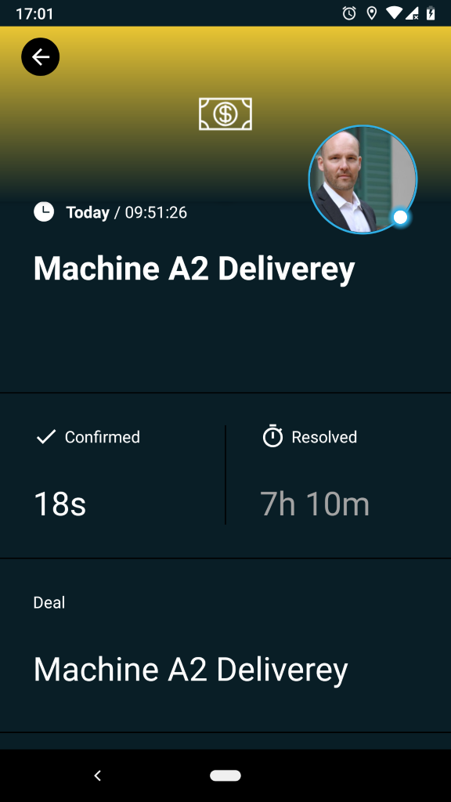

# Mobile Alarmierung per App, SMS und Anruf für Automate.io

Mobile Alarmierung mit Tracking, Bereitschafts-Planung und Eskalation für Automate.io.

## Warum SIGNL4

Automate.io ist eine Plattform zur Workflow-Automatisierung. Sie verbindet Cloud-Anwendungen (Marketing, Vertriebsprozesse, Zahlungen oder beliebige Geschäftsprozesse) auf einfache Weise. Die Verknüpfung von Automate.io mit SIGNL4 kann Ihre täglichen Aufgaben durch die zuverlässige Alarmierung mobiler Teams verbessern, egal wo sich diese befinden.

## So funktioniert es

Alles, was für die Verknüpfung von Automate.io und SIGNL4 nötig ist, ist eine Webhooks-Aktion in Ihrem Automate.io-Bot, die den SIGNL4-Webhook aufruft, um die Benachrichtigung zu senden.

## Integration

- Weiterleitung von wichtigen Meldungen an verantwortliche Teams
- Einfache Anbindung an SIGNL4 per Webhook (HTTP Post)
- Alarmierung des Teams in SIGNL4 per mobilem Push, Text und Sprache
- Nachverfolgung und transparente Quittierung in der mobilen App
- Eskalation von Alarmen wenn eine bestimmte Zeit verstrichen ist
- Integrierte Bereitschaftsplanung, um die richtigen Personen zur richtigen Zeit zu alarmieren

## Szenarien

- Workflow-Automatisierung
- DevOps
- IT-Betriebsabläufe
- Servicemanagement
- IoT
- Produktion und Fertigung, Versorgungs-Sektor, Öl und Gas, Landwirtschaft, etc.

## Und so funktioniert es

### Integration von SIGNL4 mit Automate.io

In unserem Beispiel integrieren wir HubSpot CRM mit Automate.io, um bei einem neuen Deal eine Benachrichtigung an ein SIGNL4-Team zu senden.

SIGNL4 ist eine mobile App mit der Teams schneller und effektiver auf kritische Alarme, technische Störungen und dringende Service-Aufträge reagieren können. Holen Sie sich die App unter https://www.signl4.com.

### Voraussetzungen

Ein SIGNL4-Konto (https://www.signl4.com)

Ein Automate.io-Konto (https://automate.io)

#### Integrations-Schritte

1. Bot erstellen  

Melden Sie sich am Automate.io-Portal an und erstellen Sie einen neuen Bot.

Das Endergebnis unseres Bot wird so aussehen.

2. HubSpot CRM Activity hinzufügen  

Fügen Sie die Activity HubSpot CRM hinzu. Dabei müssen Sie Ihre HubSpot-Anmeldeinformationen bestätigen. Automate.io wird dann als App in HubSpot angezeigt.

In der HubSpot CRM Activity in Ihrem Automate.io Bot können Sie nun den Trigger New Deal auswählen. Diese wird bei jeder Erstellung eines neuen Deals in HubSpot CRM ausgelöst.

3. Webhooks Activity hinzufügen  

Jetzt können Sie die Webhooks-Activity hinzufügen, die den HTTP-Post an SIGNL4 sendet.

Wählen Sie POST Data aus. Die URL ist Ihre SIGNL4 Webhook-URL inklusive Ihres Team-Geheimnisses. Der Content Type ist JSON. Unter Date tragen Sie die JSON-Daten ein, die Sie an SIGNL4 senden möchten. Sie können dynamische Felder aus der HubSpot CRM Activity einfach per Drag&Drop einfügen.

4. Filter hinzufügen (optional)  

Sie können in der Mitte einen Filter hinzufügen, um den SIGNL4-Alarm nur unter bestimmten Bedingungen auszulösen. In unserem obigen Beispiel filtern wir nach einem Betrag größer als 200 (Euro).

5. Testen Sie es

Das ist es. Sie können nun Ihren Bot speichern und Automate.io wird Sie bitten, ihn zu testen. Es wartet dann darauf, dass ein neuer Deal in HubSpot CRM generiert wird. Dies löst den Bot aus und Ihr SIGNL4-Team erhält die Benachrichtigung (wenn der Betrag des Deals höher als 200 Euro war).

Ein Beispiel finden Sie auf in GitHub:
https://github.com/signl4/signl4-integration-automate-ip
