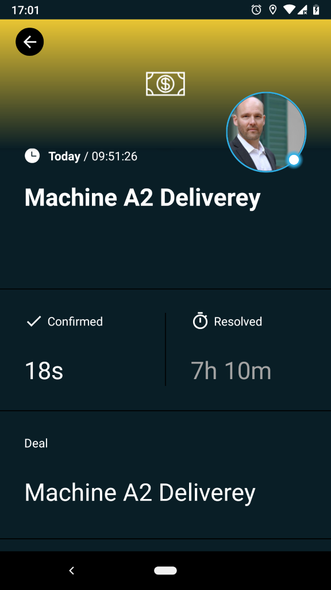
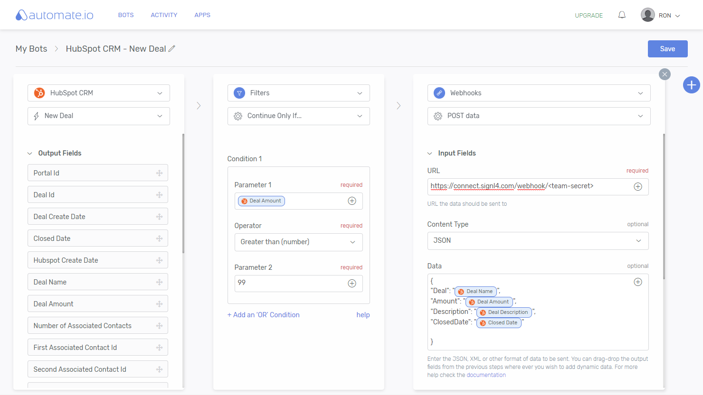

# Mobile alerting with tracking & escalation for Automate.io

Mobile alerting with tracking, duty planning and escalation for Automate.io.

## Why SIGNL4

Automate.io is a workflow automation platform. It connects all your cloud applications (marketing, sales processes, payments or any business processes) with ease. Pairing this powerful platform with SIGNL4 can enhance your daily operations with an extension to your mobile team in the field.

## How it Works

All it takes to pair Automate.io and SIGNL4 is a Webhooks action in your Automate.io Bot that calls the SIGNL4 webhook to trigger the alert.

## Integration Capabilities

- Service engineers alerted via mobile push, text and voice
- Staff can acknowledge and take ownership for critical events that occur
- Alerts are escalated in case of no response
- Communicate within an alert to address a particular problem
- Alert on critical device states
- Two-way integration to interact or set the device state

## Scenarios

- Workflow automation
- DevOps
- IT operations
- Service Management
- IoT
- IT, Manufacturing, Utility, Oil and Gas, Agriculture, etc.

## How To Integrate

### Integrating SIGNL4 with Automate.io

In our example we integrate HubSpot CRM with Automate.io in order to send an alert to a SIGNL4 team whenever there is a new deal.

SIGNL4 is a mobile alert notification app for powerful alerting, alert management and mobile assignment of work items. Get the app at https://www.signl4.com.

### Prerequisites

A SIGNL4 (https://www.signl4.com) account

An Automate.io (https://automate.io) account

#### Integration Steps

1. Create the Bot  

Logon to the Automate.io portal and create a new Bot.

The final result of our bot will look like this.

2. Add the HubSpot CRM Activity  

Add the Activity HubSpot CRM. In the process you need to confirm your HubSpot credentials. Automate.io will then appear as an app in HubSpot.

In the HubSpot CRM Activity in your Automate.io Bot you can now select the Trigger New Deal. This will be fired every time a new deal is created in HubSpot CRM.

3. Add the Webhooks Activity  

Now you can add the Webhooks activity that will send the HTTP Post request to SIGNL4.

Select POST data. The URL is your SIGNL4 webhook URL including your team secret. The Content Type is JSON. And the Data is the JSON payload you would like to send to SIGNL4. You can insert dynamic fields from the HubSpot CRM Activity just by using drag&drop.

4. Add a Filter (optional)  

You can add a Filter Action in the middle to fire the SIGNL4 alert only under certain conditions. In our example above we filter for an Amount greater than 200 (USD).

5. Test It  

This is it. You can now save your Bot and Automate.io will ask you to test it. It will then wait for a new deal to be created in HubSpot CRM. This will trigger the Bot and your SIGNL4 team will receive the alert (if the amount of the deal was greater than 200 USD).

You can find a sample in GitHub:
https://github.com/signl4/signl4-integration-automate-io
